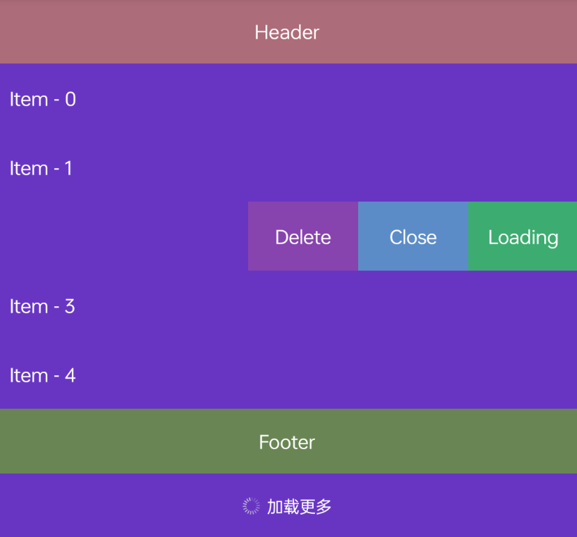

#### SwipeRecyclerView
支持侧滑菜单、长按拖拽、Header、Footer、Loading(加载更多)  

#### 资源
|名字|链接|
|-|-|
|aar|[下载](https://github.com/RelinRan/SwipeRecyclerView/blob/main/aar)|
|github |[查看](https://github.com/RelinRan/SwipeRecyclerView)|
|gitee|[查看](https://gitee.com/relin/SwipeRecyclerView)|
#### Maven
1.build.grade
```
allprojects {
    repositories {
		...
		maven { url 'https://jitpack.io' }
	}
}
```
2./app/build.grade
```
dependencies {
    implementation 'com.github.RelinRan:SwipeRecyclerView:2022.9.21.1'
}
```

#### Xml
列表布局SwipeRecyclerView
```
<androidx.widget.SwipeRecyclerView
  android:id="@+id/rv_content"
  android:layout_width="match_parent"
  android:layout_height="match_parent" />
```
Item布局item_text
```
<?xml version="1.0" encoding="utf-8"?>
<TextView xmlns:android="http://schemas.android.com/apk/res/android"
    android:id="@+id/tv_item_text"
    android:layout_width="match_parent"
    android:layout_height="50dp"
    android:background="#6835C3"
    android:gravity="center_vertical"
    android:paddingHorizontal="10dp"
    android:text="item"
    android:textColor="@android:color/white" />
```
菜单布局item_swipe_menu
```
<?xml version="1.0" encoding="utf-8"?>
<LinearLayout xmlns:android="http://schemas.android.com/apk/res/android"
    android:layout_width="wrap_content"
    android:layout_height="match_parent"
    android:orientation="horizontal">

    <TextView
        android:id="@+id/tv_delete"
        android:layout_width="80dp"
        android:layout_height="match_parent"
        android:background="#8743AE"
        android:gravity="center"
        android:text="Delete"
        android:textColor="@color/white" />

    <TextView
        android:id="@+id/tv_close"
        android:layout_width="80dp"
        android:layout_height="match_parent"
        android:background="#5C8CC7"
        android:gravity="center"
        android:text="Close"
        android:textColor="@color/white" />

    <TextView
        android:id="@+id/tv_loading"
        android:layout_width="80dp"
        android:layout_height="match_parent"
        android:background="#3CAC70"
        android:gravity="center"
        android:text="Loading"
        android:textColor="@color/white" />

</LinearLayout>
```
Header布局item_header
```
<?xml version="1.0" encoding="utf-8"?>
<LinearLayout xmlns:android="http://schemas.android.com/apk/res/android"
    android:layout_width="match_parent"
    android:layout_height="wrap_content"
    android:orientation="horizontal">

    <TextView
        android:layout_width="match_parent"
        android:layout_height="48dp"
        android:background="#AD6C79"
        android:gravity="center"
        android:orientation="vertical"
        android:text="Header"
        android:textColor="@android:color/white"></TextView>

</LinearLayout>
```
Footer布局item_footer
```
<?xml version="1.0" encoding="utf-8"?>
<LinearLayout xmlns:android="http://schemas.android.com/apk/res/android"
    android:layout_width="match_parent"
    android:layout_height="wrap_content"
    android:orientation="horizontal">

    <TextView
        android:layout_width="match_parent"
        android:layout_height="48dp"
        android:background="#698554"
        android:gravity="center"
        android:orientation="vertical"
        android:text="Footer"
        android:textColor="@android:color/white"></TextView>

</LinearLayout>
```
Loading布局item_loading
```
<?xml version="1.0" encoding="utf-8"?>
<FrameLayout xmlns:android="http://schemas.android.com/apk/res/android"
    android:layout_width="match_parent"
    android:layout_height="match_parent">

    <androidx.widget.SwipeLoadingLayout
        android:id="@+id/item_loading_more"
        android:layout_width="match_parent"
        android:layout_height="48dp"/>

</FrameLayout>
```
#### Adapter
```
import android.content.Context;
import android.graphics.Color;
import android.os.Bundle;
import androidx.widget.SwipeLoadingLayout;
import androidx.widget.SwipeRecyclerAdapter;
import androidx.widget.ViewHolder;

public class SwipeItemAdapter extends SwipeRecyclerAdapter<String> {
    public SwipeItemAdapter(Context context) {
        super(context);
    }

    @Override
    public int getHeaderLayoutResId() {
        //如果adapter.setHeaderView设置了此处不再需要重写设置
        return R.layout.item_header;
    }

    @Override
    protected void onHeaderBindViewHolder(ViewHolder holder, Bundle args) {
        super.onHeaderBindViewHolder(holder, args);
        // TODO:Header数据绑定操作
    }

    @Override
    protected int getItemLayoutResId(int viewType) {
        // TODO: 普通Item布局
        return R.layout.item_text;
    }

    @Override
    protected void onItemBindViewHolder(ViewHolder holder, int position) {
        super.onItemBindViewHolder(holder, position);
        // TODO: 普通item数据绑定（如果有侧滑菜单，就重写onSwipeBindViewHolder方法，不在此处处理）
    }

    @Override
    protected int getItemSwipeMenuLayoutResId() {
        // TODO: 侧滑菜单栏布局（例如：编辑、删除）
        // 注意xml高度:MATCH_PARENT，宽度：WRAP_CONTENT
        return R.layout.item_swipe_menu;
    }

    @Override
    protected void onSwipeBindViewHolder(ViewHolder holder, int position) {
        super.onSwipeBindViewHolder(holder, position);
        // TODO: 普通Item + 侧滑view数据绑定逻辑
        holder.addItemClick(R.id.tv_delete);
        holder.addItemClick(R.id.tv_close);
        holder.addItemClick(R.id.tv_loading);
        TextView textView = holder.find(R.id.tv_item_text);
        textView.setText(getItem(position));
    }

    @Override
    public int getFooterLayoutResId() {
        //如果adapter.setFooterView设置了此处不再需要重写设置
        return R.layout.item_footer;
    }

    @Override
    protected void onFooterBindViewHolder(ViewHolder holder, Bundle args) {
        super.onFooterBindViewHolder(holder, args);
        // TODO:Footer数据绑定操作
    }

    @Override
    public int getLoadingLayoutResId() {
        //如果adapter.setLoadingView设置了此处不再需要重写设置
        return R.layout.item_loading;
    }

    @Override
    protected void onLoadingBindViewHolder(ViewHolder holder, Bundle args) {
        super.onLoadingBindViewHolder(holder, args);
        //此处是找到默认的加载更多View的SwipeLoadingLayout操作对象
        SwipeLoadingLayout loadingLayout = holder.find(R_ID_LOADING_MORE);
        loadingLayout.setTextColor(Color.WHITE);
    }
    
}
```
#### 设置加载
```
SwipeRecyclerView rv_content = findViewById(R.id.rv_content);
rv_content.setLayoutManager(new LinearLayoutManager(this,LinearLayoutManager.VERTICAL,false));
//适配器
SwipeItemAdapter adapter = new SwipeItemAdapter(this);

//设置侧滑菜单可用
adapter.setShowSwipe(true);
//设置是否单个侧滑
adapter.setSingleSwipe(true);
//设置监听到除自己滑动就自动关闭侧滑
adapter.setScrollClose(true);

//设置长按拖拽
rv_content.setLongPressDragEnabled(false);

//Header,若Adapter重写getHeaderLayoutResId方法设置了就不用设置了
TextView header = new TextView(this);
header.setGravity(Gravity.CENTER);
header.setTextColor(Color.WHITE);
header.setBackgroundColor(Color.parseColor("#AD6C79"));
header.setText("Header");
adapter.setHeaderView(header,120);
adapter.setShowHeader(true);

//Footer，若Adapter重写getFooterLayoutResId方法设置了就不用设置了
TextView footer = new TextView(this);
footer.setGravity(Gravity.CENTER);
footer.setTextColor(Color.WHITE);
footer.setBackgroundColor(Color.parseColor("#698554"));
footer.setText("Footer");
adapter.setFooterView(footer,120);
adapter.setShowFooter(true);

//加载更多View，若Adapter重写getFooterLayoutResId方法设置了就不用设置了
SwipeLoadingLayout loading = new SwipeLoadingLayout(this);
loading.setId(adapter.R_ID_LOADING_MORE);
adapter.setLoadingView(loading,120);
//滑动到底部会自动显示加载更多
adapter.setShowLoading(true);

//设置加载更多颜色
adapter.setLoadingBackgroundColor(Color.parseColor("#6835C3"));
//强制显示加载更多
adapter.setOnLoadListener(() -> {
    //处理加载更多逻辑
    new Handler().postDelayed(new Runnable() {
        @Override
        public void run() {
            adapter.setLoading(false);
        }
    },1000);
});

//设置此方法之前，在SwipeItemAdapter中holder.addItemClick(R.id.xxx);
adapter.setOnItemClickListener((apt, v, position) -> {
    if (v.getId()==R.id.tv_delete){
        adapter.removeItem(position);
    }
    if (v.getId()==R.id.tv_close){
        adapter.closeSwipe(position);
    }
    if (v.getId()==R.id.tv_loading){
        adapter.setLoading(true);//加载中
    }
});
rv_content.setAdapter(adapter);

//设置数据源
List<String> list = new ArrayList<>();
for (int i = 0; i < 10; i++) {
    list.add("Item - "+i);
}
adapter.setDataSource(list);
```
